# Electric Twin — Survey Creator: AI Interaction Model

## 1. Overview

This document defines the core objects, relationships, and user journey for the Electric Twin survey creator. The system allows users to build and run surveys powered by AI, supporting a range of survey types from simple questionnaires to complex concept and creative tests. The model is designed so that an AI agent can understand the structure of any survey, generate appropriate questions, handle stimulus material, and produce findings per question.

---

## 2. Core Objects

The interaction model is built around five core objects:

| Object | Description |
|---|---|
| **Survey Type** | The kind of survey being created — determines default question sets, whether stimulus is required, and how results are reported |
| **Question** | An individual survey item with a specific question type, answer format, and optional per-question stimulus |
| **Stimulus** | Supporting material (text, image, video, concept description) shown to respondents — can be scoped to the whole survey or to a single question |
| **Audience / Segment** | Who the survey targets — a single audience or multiple segments for comparative analysis |
| **Report / Findings** | The output — per-question data, findings, and roll-up insights |

---

## 3. Survey Types

A survey type is the top-level selection that shapes the entire survey structure. Each type comes with a default set of recommended question types, stimulus expectations, and audience configuration.

### 3.1 Standard Survey Types

**Simple Survey** — A straightforward list of questions and answers with no stimulus. Used for general-purpose feedback, polls, and data collection. Typically single-audience. Questions are freeform — the user picks whatever question types they want.

**Concept Testing** — Evaluates one or more product concepts, ideas, or propositions before launch. Stimulus is required (concept descriptions, mockups, or prototypes). Measures appeal, uniqueness, purchase intent, comprehension, and relevance. Can be monadic (one concept per respondent), sequential monadic (multiple concepts shown in sequence), or comparative (side-by-side). Often multi-segment to compare reactions across demographics.

**Message Testing** — Tests marketing messages, taglines, value propositions, or positioning statements. Stimulus is text-based (message variants). Measures clarity, persuasiveness, relevance, and differentiation. Typically comparative — respondents see multiple message variants. Useful for A/B pre-testing before campaign launch.

**Creative Testing** — Evaluates advertising creative: images, videos, ad copy, or full ad units. Stimulus is visual/multimedia. Measures attention, recall, emotional response, brand fit, and call-to-action effectiveness. Often uses image-pick and rating question types. May use monadic or sequential monadic methodology.

**Brand Tracking** — Recurring survey measuring brand awareness, perception, and consideration over time. Typically no stimulus (or minimal). Heavy use of rating scales and aided/unaided recall questions. Multi-wave — designed to be repeated at intervals.

**Audience Exploration** — Segmentation and profiling research to understand a target group's behaviours, attitudes, and demographics. Uses multi-select, ranking, and scale questions. Often multi-segment for comparison across groups.

### 3.2 Custom Templates

Users can create their own survey templates by assembling a custom set of question types, configuring stimulus settings, and saving the configuration for reuse. A custom template stores the survey structure (question types and order), default stimulus configuration (on/off, survey-level or per-question), audience configuration defaults, and agent prompts for AI-generated question suggestions.

---

## 4. Question Types

Each question in a survey has a **question type** that defines its answer format, UI rendering, and how the AI agent should interpret and generate it. Below is a taxonomy of question types organised into categories.

### 4.1 Selection Questions

These are the most common survey questions — the respondent picks from predefined options.

**Single Select (Radio)** — Respondent picks exactly one answer from a list. Use for mutually exclusive choices. Example: "What is your primary mode of transport?" → Car / Bus / Bike / Walk. Agent prompt hint: Generate 4–7 mutually exclusive options that are collectively exhaustive. Always include an "Other" option where appropriate.

**Multi Select (Checkbox)** — Respondent picks one or more answers. Use for "select all that apply" questions. Example: "Which of these brands have you heard of?" → [list of brands]. Agent prompt hint: Options need not be mutually exclusive. Consider including "None of the above" as a final option.

**Dichotomous (Yes/No)** — Binary choice. Use for simple filtering or screening. Example: "Have you purchased this product in the last 3 months?" → Yes / No. Agent prompt hint: Keep the question unambiguous so that yes/no is a clear answer.

### 4.2 Image & Media Questions

These questions use visual or media stimulus as the answer options themselves.

**Image Pick (Single)** — Respondent selects one image from a set of 2–6 images. Use for preference testing, packaging selection, or creative comparison. Example: "Which packaging design do you prefer?" → [Image A] [Image B] [Image C]. Agent prompt hint: Ensure images are clearly differentiated. Provide a brief label or caption for accessibility.

**Image Pick (Multi)** — Respondent selects one or more images. Use for broader appeal testing. Example: "Which of these designs would you consider purchasing?" → [Images]. Agent prompt hint: Same as single image pick but phrase the question to allow multiple selections.

**Video Evaluation** — Respondent watches a video and then answers follow-up questions. Use for ad testing or concept demonstration. The video is typically stimulus attached to the question.

### 4.3 Rating & Scale Questions

These questions measure degree, intensity, or position on a spectrum.

**Likert Scale** — Agreement/disagreement scale, typically 5 or 7 points. Example: "I would recommend this product to a friend" → Strongly Disagree / Disagree / Neutral / Agree / Strongly Agree. Agent prompt hint: Use balanced scales with a clear midpoint. Label all points for clarity.

**Numeric Rating (NPS-style)** — Numeric scale, commonly 0–10 or 1–5. Example: "How likely are you to recommend us?" → 0 (Not at all likely) to 10 (Extremely likely). Agent prompt hint: Clearly label the endpoints. For NPS, always use 0–10.

**Semantic Differential** — Respondent rates between two opposite descriptors. Example: "Rate this product:" → Boring ←——→ Exciting. Agent prompt hint: Choose genuinely opposite pairs. Use 5 or 7 points between them.

**Star Rating** — Visual star-based rating, typically 1–5 stars. Use for quick satisfaction or quality ratings. Intuitive and fast for respondents.

**Slider / Continuous Scale** — Respondent moves a slider along a continuous range. Example: "How important is price when choosing a brand?" → Not important ←——→ Very important. Agent prompt hint: Label the endpoints clearly. Consider showing the numeric value as the slider moves.

### 4.4 Ranking & Ordering Questions

These questions ask respondents to prioritise or sort options.

**Rank Order** — Respondent drags items into their preferred order (1st, 2nd, 3rd…). Example: "Rank these features by importance:" → [Feature A] [Feature B] [Feature C] [Feature D]. Agent prompt hint: Limit to 5–7 items maximum — ranking more than that is cognitively taxing. Ensure items are at a comparable level of abstraction.

**Max-Diff (Best-Worst Scaling)** — Respondent sees a subset of items and picks the best and worst. Repeated across multiple sets. Produces a robust preference ranking across many items without overwhelming the respondent. Agent prompt hint: Use when you have 8+ items to rank. Each set should show 4–5 items.

### 4.5 Open-Ended Questions

These capture free-text responses for qualitative insight.

**Short Text** — Single-line text input. Example: "What is the first word that comes to mind when you think of our brand?" Agent prompt hint: Use for top-of-mind associations, one-word or short-phrase answers. Set a character limit to guide response length.

**Long Text (Comment Box)** — Multi-line text input for detailed responses. Example: "Please describe your experience with our customer support." Agent prompt hint: Use sparingly — long text creates survey fatigue. Place after rating questions to capture "why."

### 4.6 Matrix & Grid Questions

These ask multiple related sub-questions using the same answer scale.

**Matrix (Single Answer per Row)** — Grid where each row is a statement and columns are the scale. Example: "Rate each feature:" rows = [Speed, Design, Price], columns = [Poor, Fair, Good, Excellent]. Agent prompt hint: Keep to 5–7 rows maximum. Ensure the column scale applies equally to all rows.

**Matrix (Multi Answer per Row)** — Same as above but respondents can select multiple columns per row. Use for "which attributes apply to which product" style questions.

### 4.7 Specialised Question Types

**Constant Sum** — Respondent allocates a fixed total (e.g., 100 points) across options to show relative importance. Example: "Distribute 100 points across these features based on importance." Agent prompt hint: Always state the total clearly. Use when relative weighting matters more than absolute ratings.

**Card Sort** — Respondent sorts items into predefined or custom categories. Use for information architecture research or mental model mapping.

**Heatmap / Click Map** — Respondent clicks on areas of an image to indicate interest, attention, or preference. Use for packaging, website, or ad layout testing.

### 4.8 Question Type Summary Table

| Category | Question Type | Answers | Best For |
|---|---|---|---|
| Selection | Single Select | 1 from list | Mutually exclusive choices |
| Selection | Multi Select | N from list | "Select all that apply" |
| Selection | Dichotomous | Yes/No | Screening, binary filters |
| Image/Media | Image Pick (Single) | 1 image | Preference, packaging testing |
| Image/Media | Image Pick (Multi) | N images | Broad appeal testing |
| Image/Media | Video Evaluation | Follow-up Qs | Ad/creative testing |
| Rating | Likert Scale | 5–7 point agree/disagree | Attitude measurement |
| Rating | Numeric Rating | 0–10 or 1–5 | NPS, CSAT |
| Rating | Semantic Differential | Bipolar scale | Brand perception |
| Rating | Star Rating | 1–5 stars | Quick satisfaction |
| Rating | Slider | Continuous range | Importance, intensity |
| Ranking | Rank Order | Ordered list | Feature prioritisation |
| Ranking | Max-Diff | Best/worst picks | Large item sets |
| Open-Ended | Short Text | Free text (short) | Top-of-mind, associations |
| Open-Ended | Long Text | Free text (long) | Qualitative "why" |
| Matrix | Matrix (Single) | 1 per row | Multi-attribute rating |
| Matrix | Matrix (Multi) | N per row | Attribute–product mapping |
| Specialised | Constant Sum | Point allocation | Relative importance |
| Specialised | Card Sort | Categorisation | Mental models, IA |
| Specialised | Heatmap | Click locations | Visual attention, layout |

---

## 5. Stimulus

Stimulus is any material shown to respondents to provide context for their answers. It is a critical object in testing-type surveys and has two scoping levels.

### 5.1 Stimulus Types

| Stimulus Type | Description | Common Survey Types |
|---|---|---|
| **Text / Copy** | Written descriptions, taglines, marketing messages, value propositions | Message Testing, Concept Testing |
| **Image** | Photos, illustrations, packaging mockups, ad stills, logos | Creative Testing, Concept Testing |
| **Video** | Ads, product demos, explainer videos, animated concepts | Creative Testing |
| **Concept Description** | Structured write-up of a product/service idea (often text + image) | Concept Testing |
| **Prototype / Interactive** | Clickable mockup or interactive demo | Concept Testing (advanced) |

### 5.2 Stimulus Scope

This is a key architectural decision. Stimulus can be attached at two levels:

**Survey-Level Stimulus (Stem)** — A single piece of stimulus that applies to the entire survey. All questions reference the same material. The respondent sees it once at the start (or it remains visible/accessible throughout). Use when: the whole survey is about evaluating one concept, one creative, or one message. Example: "Here is a concept for a new meal-kit delivery service. Please answer the following questions about it."

**Question-Level Stimulus** — A specific piece of stimulus attached to an individual question. Different questions can have different stimulus, or some questions can have stimulus while others don't. Use when: testing multiple creatives, comparing messages, or showing different images per question. Example: Question 3 shows Image A, Question 4 shows Image B, and both ask "How appealing is this design?"

**Combined approach** — A survey can have both a survey-level stem (the baseline context) and per-question stimulus (additional material for specific questions). For instance, a concept test might show the concept description as the stem, but individual questions might show specific packaging variants as per-question stimulus.

### 5.3 Stimulus × Methodology

For concept and creative testing, the testing methodology affects how stimulus is handled:

In **monadic** testing, each respondent sees one stimulus variant. The survey-level stem is that one variant, and all questions relate to it. You need multiple respondent groups (one per variant).

In **sequential monadic** testing, each respondent sees multiple variants in sequence. Each section of the survey has its own survey-level stimulus. Question order may be randomised to avoid order effects.

In **comparative** testing, respondents see all variants at once and directly compare them. Image-pick and ranking questions are common. Stimulus is embedded in the question itself.

---

## 6. Audiences & Segments

### 6.1 Single Audience

The simplest configuration — one target group answers the survey. Useful for: general feedback, CSAT, simple polls, or when the target market is homogeneous.

### 6.2 Multi-Segment

The survey is distributed to multiple audience segments, with results analysed both per-segment and in aggregate. Segments can be defined by demographics (age, gender, income, location), behavioural criteria (purchase frequency, brand usage, loyalty tier), psychographics (values, lifestyle, attitudes), or custom criteria (existing customers vs. prospects, power users vs. casual users).

Multi-segment surveys enable comparisons — "Do Gen Z respondents prefer Concept A while Boomers prefer Concept B?" — and are essential for concept testing and brand tracking.

### 6.3 Audience Configuration

The audience object stores the segment definition (targeting criteria), sample size per segment, quota requirements (e.g., 50/50 gender split), and screening questions (if needed to qualify respondents).

---

## 7. Data Model

The following diagram shows how the core objects relate to each other.

---

## 8. User Journey: Creating a Survey

The survey creation flow has multiple entry paths that converge into a common review-and-run phase. The product uses a **Builder** navigation pattern: left sidebar TOC with step status, focused main area, and a persistent bottom action bar with step-specific CTAs.

> **Implementation note:** The builder uses a dynamic flow: Type → Audience → [Stimulus if needed] → Questions → Preview. The flow adapts based on the survey type — Concept/Message/Creative Testing adds a Stimulus step (5 steps total); other types have 4 steps. Method selection (AI, manual, template) happens within the Questions step, not as a separate step. Results live on a separate canvas. The interactive prototype (`survey-ux-mockup.html`) includes Results in the sidebar for demonstration. Wizard and Single Page modes are also in the prototype for stakeholder comparison but are not the shipping direction.

### 8.1 Step-by-Step Flow

**Step 1 — Type** — The user selects the kind of survey from a 3×2 grid of six types (Simple Survey, Concept Testing, Message Testing, Creative Testing, Brand Tracking, Audience Exploration). The bottom bar confirms the selection before advancing. This selection shapes the entire flow — the sidebar rebuilds dynamically to show the relevant steps, and screen headers adapt to the chosen type.

**Step 2 — Audience** — The user specifies who should answer the survey. Screen headers adapt to the type (e.g., "Who will evaluate these concepts?" for Concept Testing). Two-step selection: first pick Single Audience or Multi-Segment, then choose a specific audience from suggested options or define custom criteria. The bottom bar only enables after a specific audience is selected.

**Step 3 (conditional) — Stimulus** — For Concept Testing, Message Testing, and Creative Testing only. The user uploads the materials respondents will evaluate — concepts, messages, or creative assets. Headers adapt to type ("Add your concepts" vs. "Add your creative"). This step does not appear for Simple Survey, Brand Tracking, or Audience Exploration.

**Step 3 or 4 — Questions** — This step has two phases. First, the user chooses a build method from a gateway screen: Generate with AI (describe objectives or upload a brief), Build From Scratch, or pick a Template. After choosing, the user enters a two-panel question editor: question list with drag-to-reorder (left) and editor canvas (right) with inline type dropdown, answer options, settings, and AI suggestions.

*Path A: Generate with AI.* Describe objectives and/or upload a research brief. AI generates the full survey. The user lands in the editor with pre-populated questions.

*Path B: Template.* Select a pre-built template. Questions are pre-populated. The user customises in the editor.

*Path C: Build From Scratch.* The user lands in an empty editor and adds questions one by one.

> **Note:** The full "upload a research brief and generate an entire survey" AI path is handled separately through agentic chat. The builder's AI path is a lighter-weight describe-or-upload flow within the Questions step.

**Final Step — Preview** — The user sees the complete survey: all questions in order with type badges and answer previews, stimulus preview (for testing types), audience breakdown in the sidebar, and an AI review box with improvement suggestions. The final CTA is "Launch survey →", which exits the builder.

### 8.1.1 Results Canvas (Separate View)

Results are **not** part of the builder. Once a survey is launched, the user navigates to the results canvas from a dashboard, survey list, or notification.

The results canvas is a single-column scroll of per-question findings. Each question produces a finding row with an editable AI insight (left: big stat + narrative text) alongside chart data with segment breakdowns (right). Three view tabs: Per Question, Full Report, Segments. AI-generated insights are always editable — click Edit to make text contenteditable, click Save to lock.

### 8.2 User Journey Flowchart

```mermaid
flowchart TD
    START([Create Survey]) --> SELECT_TYPE{Select Survey Type}

    SELECT_TYPE --> SIMPLE[Simple Survey]
    SELECT_TYPE --> CONCEPT[Concept Testing]
    SELECT_TYPE --> MESSAGE[Message Testing]
    SELECT_TYPE --> CREATIVE[Creative Testing]
    SELECT_TYPE --> BRAND[Brand Tracking]
    SELECT_TYPE --> EXPLORE[Audience Exploration]

    SIMPLE --> AUDIENCE
    CONCEPT --> AUDIENCE
    MESSAGE --> AUDIENCE
    CREATIVE --> AUDIENCE
    BRAND --> AUDIENCE
    EXPLORE --> AUDIENCE

    AUDIENCE{Define Audience}
    AUDIENCE --> SINGLE_AUD[Single Audience]
    AUDIENCE --> MULTI_SEG[Multi-Segment]

    SINGLE_AUD --> STIM_CHECK
    MULTI_SEG --> STIM_CHECK

    STIM_CHECK{Type needs stimulus?}
    STIM_CHECK --> |Yes: Concept/Message/Creative| STIMULUS[Upload Stimulus Materials]
    STIM_CHECK --> |No: Simple/Brand/Audience| QUESTIONS

    STIMULUS --> QUESTIONS

    QUESTIONS{How do you want to add questions?}
    QUESTIONS --> PATH_A["🤖 Generate with AI"]
    QUESTIONS --> PATH_B["✏️ Build From Scratch"]
    QUESTIONS --> PATH_C["📋 Pick a Template"]

    PATH_A --> |AI generates questions| EDITOR
    PATH_B --> |empty editor| EDITOR
    PATH_C --> |pre-populated questions| EDITOR

    EDITOR[Edit, Reorder & Refine Questions]
    EDITOR --> PREVIEW

    PREVIEW[Preview Full Survey]
    PREVIEW --> AI_SUGGEST[AI Suggests Improvements]
    AI_SUGGEST --> LAUNCH_READY{Ready to Launch?}
    LAUNCH_READY --> |No| EDITOR
    LAUNCH_READY --> |Yes| LAUNCH

    LAUNCH([Launch — exits builder])
    LAUNCH -.->|separate canvas| RESULTS

    RESULTS[Results Canvas]
    RESULTS --> PER_Q[Per-Question Finding + Data]
    RESULTS --> REPORT[Roll-Up Report + Insights]
```

---

## 9. Agent Behaviour Model

The AI agent plays a different role at each stage of the survey lifecycle. This section defines what the agent knows and does at each step.

**During survey type selection** — The agent can recommend a survey type based on the user's stated objective ("I want to test two ad concepts" → Creative Testing, comparative methodology). It explains trade-offs between types.

**During question generation** — The agent uses the question type's `agent_prompt_template` to generate well-formed questions. It respects the survey type's recommended question types. It ensures answer options follow best practices (balanced scales, exhaustive options, no double-barrelled questions). It adapts question wording to the target audience's language level.

**During stimulus configuration** — The agent advises on stimulus scope (survey-level vs. question-level) based on the testing methodology. It flags when stimulus is missing but expected for the survey type.

**During review** — The agent suggests improvements: question rewording for clarity, missing "None of the above" or "Other" options, survey length warnings (typical completion time), logical flow issues (screening questions should come first), and bias detection (leading questions, unbalanced scales).

**During findings** — The agent generates per-question insight summaries. It highlights statistically significant differences across segments. It produces a narrative roll-up report across all questions.

---

## 10. Next Steps & Open Questions

The following items need further definition:

**Stimulus versioning** — When doing monadic or sequential monadic testing, how are stimulus variants managed? Is each variant a separate stimulus object linked to a respondent group, or is there a "stimulus set" container?

**Question logic & branching** — Should questions support skip logic (if answer = X, skip to question Y)? This adds complexity but is standard in survey tools.

**Quotas and screening** — How tightly integrated is the screening/quota system with the audience object? Are screening questions a special question type or a separate object?

**Collaboration** — Can multiple users edit a survey simultaneously? Is there a draft/review/approval workflow?

**Localisation** — Should surveys support multiple languages? If so, how does this interact with AI-generated questions and stimulus?

---

*Document version: 0.4 — February 2026*
*Builder is the shipping navigation mode. Builder uses a dynamic flow: Type → Audience → [Stimulus if needed] → Questions → Preview. Survey types: Simple Survey, Concept Testing, Message Testing, Creative Testing, Brand Tracking, Audience Exploration. Method selection (AI, manual, template) is within the Questions step. Results live on a separate canvas. Prototype retains Results and Wizard/Single Page modes for stakeholder demos.*
