# Electric Twin — Survey Interaction Model: Key Diagrams

---

## 1. Core Object Model

How the five core objects relate to each other. A **Survey Type** shapes the survey. A **Survey** contains questions, targets audiences, and optionally carries stimulus. Each **Question** produces **Findings** scoped to an audience.

---

## 2. Survey Types & What They Require

Each survey type has different expectations for stimulus, question types, and audience configuration.

```mermaid
graph LR
    subgraph SURVEY_TYPES[" "]
        direction TB
        SIMPLE["🔵 Simple Survey"]
        CONCEPT["🟣 Concept Testing"]
        MESSAGE["🟡 Message Testing"]
        CREATIVE["🟠 Creative Testing"]
        BRAND["🟢 Brand Tracking"]
        EXPLORE["🔴 Audience Exploration"]
    end

    subgraph STIMULUS_REQ["Stimulus"]
        direction TB
        NONE["None"]
        TEXT_STIM["Text / Copy"]
        VISUAL["Image / Video"]
        CONCEPT_DESC["Concept Descriptions"]
    end

    subgraph AUDIENCE_REQ["Audience"]
        direction TB
        SINGLE["Single"]
        MULTI["Multi-Segment"]
    end

    subgraph METHOD["Methodology"]
        direction TB
        FREEFORM["Freeform"]
        MONADIC["Monadic"]
        SEQ_MON["Sequential Monadic"]
        COMPARATIVE["Comparative"]
    end

    SIMPLE --> NONE
    SIMPLE --> SINGLE
    SIMPLE --> FREEFORM

    CONCEPT --> CONCEPT_DESC
    CONCEPT --> MULTI
    CONCEPT --> MONADIC
    CONCEPT --> SEQ_MON

    MESSAGE --> TEXT_STIM
    MESSAGE --> MULTI
    MESSAGE --> COMPARATIVE

    CREATIVE --> VISUAL
    CREATIVE --> MULTI
    CREATIVE --> MONADIC

    BRAND --> NONE
    BRAND --> MULTI
    BRAND --> FREEFORM

    EXPLORE --> NONE
    EXPLORE --> MULTI
    EXPLORE --> FREEFORM
```

---

## 3. Question Type Taxonomy

Seven categories covering all common survey question formats. The AI agent uses the category and type to generate appropriate questions and answer options.

```mermaid
mindmap
  root((Question Types))
    Selection
      Single Select
      Multi Select
      Yes / No
    Image & Media
      Image Pick ×1
      Image Pick ×N
      Video Eval
    Rating & Scale
      Likert 5–7pt
      Numeric 0–10
      Semantic Differential
      Star Rating
      Slider
    Ranking
      Rank Order
      Max-Diff
    Open-Ended
      Short Text
      Long Text
    Matrix
      Single per Row
      Multi per Row
    Specialised
      Constant Sum
      Card Sort
      Heatmap
```

---

## 4. User Journey — Builder (Dynamic Steps) + Results Canvas

Type-first flow with dynamic sidebar. Stimulus step appears conditionally. Method selection is within the Questions step. Results live on a separate canvas.

```mermaid
flowchart TD
    START([Create Survey]) --> TYPE[Select Survey Type]

    TYPE --> |Sidebar rebuilds| AUD[Define Audience]

    AUD --> STIM_CHECK{Type needs stimulus?}
    STIM_CHECK --> |Concept/Message/Creative| STIM["Upload Stimulus Materials"]
    STIM_CHECK --> |Simple/Brand/Audience| QUESTIONS

    STIM --> QUESTIONS

    QUESTIONS{How do you want to add questions?}
    QUESTIONS --> A["🤖 Generate with AI"]
    QUESTIONS --> B["✏️ Build From Scratch"]
    QUESTIONS --> C["📋 Pick a Template"]

    A --> |AI generates questions| EDITOR
    B --> |empty editor| EDITOR
    C --> |pre-populated| EDITOR

    EDITOR["Edit, Reorder & Refine\n+ drag-to-reorder\n+ AI suggestions"]
    EDITOR --> PREVIEW

    PREVIEW["Preview Full Survey\n+ AI review suggestions"]
    PREVIEW --> READY{Happy?}
    READY --> |No| EDITOR
    READY --> |Yes| LAUNCH

    LAUNCH([Launch — exits builder])
    LAUNCH -.->|separate canvas| RESULTS

    RESULTS["Results Canvas"]
    RESULTS --> PERQ["Per-Question Finding\ndata + AI insight"]
    RESULTS --> ROLL["Roll-Up Report\ncross-question narrative"]
```

